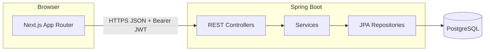

# Job application tracker

Production-oriented starter: **Next.js (TypeScript)** + **Spring Boot REST** + **PostgreSQL**, with JWT auth, validation, RFC 7807-style errors (`ProblemDetail`), Flyway migrations, OpenAPI/Swagger UI, and a responsive UI.

## 1. High-level architecture



- **Frontend** talks only to the **backend REST API** (no Next.js server-side data layer in this starter). A small **API client** centralizes `fetch`, JWT headers, and error handling.
- **Backend** enforces **stateless JWT** authentication, **per-user row ownership** on job applications, and **layered architecture** (controller → service → repository).
- **PostgreSQL** is the source of truth; **Flyway** owns the schema in the default profile; **Hibernate** validates mappings against it.

**Security note:** The UI stores the JWT in `localStorage` for simplicity. For hardened production, prefer **httpOnly, Secure, SameSite** cookies issued by the backend (or a BFF) to reduce XSS token theft risk.

## 2. Folder structure

```text
job-tracker/
├── docker-compose.yml          # PostgreSQL for local dev
├── scripts/
│   └── dev.sh                  # Run DB + API + Next.js (see below)
├── README.md
├── backend/                    # Spring Boot 3.4, Java 21
│   ├── mvnw                    # Maven Wrapper (no global Maven install)
│   ├── pom.xml
│   └── src/main/
│       ├── java/com/jobtracker/
│       │   ├── JobTrackerApplication.java
│       │   ├── config/         # Security, JWT props, OpenAPI
│       │   ├── controller/     # REST adapters
│       │   ├── dto/            # request / response records
│       │   ├── domain/         # JPA entities + enums
│       │   ├── exception/      # ApiException + @ControllerAdvice
│       │   ├── repository/     # Spring Data JPA
│       │   ├── security/       # JWT filter + AuthenticatedUser
│       │   ├── service/        # business logic
│       │   └── util/           # SecurityUtils, etc.
│       └── resources/
│           ├── application.yml
│           └── db/migration/   # Flyway SQL
└── frontend/                   # Next.js 15 App Router
    └── src/
        ├── app/                # routes, layouts
        ├── components/
        ├── lib/
        │   ├── api/            # client, auth, applications
        │   └── types.ts
        └── providers/          # AuthProvider (client state)
```

## 3. Step-by-step implementation plan

1. **Infrastructure:** Run PostgreSQL (`docker compose up -d`). Set `JWT_SECRET`, `DB_*` env vars for non-local deployments.
2. **Backend core:** Entities and repositories → Flyway baseline → `ddl-auto: validate` in default profile.
3. **Auth:** BCrypt passwords, JWT (subject = user id), `JwtAuthenticationFilter`, secure CORS for the Next origin.
4. **Applications API:** CRUD + `/stats` with `SecurityUtils.currentUserId()` so users only access their rows; optional **job listing URL** stored per application and **server-side scrape** (`/scrape-from-url`) to pre-fill company/title from HTML (Open Graph, JSON-LD `JobPosting`, `<title>` heuristics).
5. **Errors & docs:** `GlobalExceptionHandler` with `ProblemDetail`; springdoc OpenAPI + Swagger UI.
6. **Frontend:** `apiFetch` wrapper, auth screens, protected `(app)` layout, dashboard + applications CRUD UI.
7. **Hardening (next iterations):** integration tests (Testcontainers), refresh tokens or cookie session, rate limiting, structured logging, metrics, CI pipeline, Dockerfile multi-stage builds for both apps.

## 4. API summary

| Method | Path | Description |
|--------|------|-------------|
| POST | `/api/v1/auth/register` | Register (returns JWT) |
| POST | `/api/v1/auth/login` | Login (returns JWT) |
| GET | `/api/v1/applications` | List current user’s applications |
| GET | `/api/v1/applications/stats` | Counts by status + total |
| POST | `/api/v1/applications/scrape-from-url` | Fetch a public job URL and return guessed `company`, `roleTitle`, canonical `sourceUrl` (auth required; SSRF-hardened) |
| GET | `/api/v1/applications/{id}` | Get one (404 if not yours) |
| POST | `/api/v1/applications` | Create (optional `sourceUrl`) |
| PUT | `/api/v1/applications/{id}` | Update (optional `sourceUrl`) |
| DELETE | `/api/v1/applications/{id}` | Delete |

Swagger UI: [http://localhost:8080/swagger-ui.html](http://localhost:8080/swagger-ui.html) (after starting the API).

**Import from URL:** The backend combines HTML meta tags (`og:title`, `twitter:title`, JSON-LD `JobPosting`), **page &lt;title&gt;** heuristics, **&lt;h1&gt;** (outside header/nav), **host-based defaults** (e.g. [Accenture](https://www.accenture.com/), [Amazon.jobs](https://www.amazon.jobs/)), and for **Greenhouse** career sites (`careers.*.com` / `jobs.*.com` with a numeric job id) a call to Greenhouse’s public **`boards-api.greenhouse.io`** JSON API (e.g. [Duolingo careers](https://careers.duolingo.com/)). Some employers (for example [IBM Careers](https://careers.ibm.com/) behind **AWS WAF**) respond with **HTTP 202** and an empty body; the API returns **422** with guidance; you can still **save the URL** and edit fields. Heavy **SPAs** (e.g. some Lenovo listings) may return little HTML—company may be inferred from the domain with a hint to fill the title manually.

## Run locally

### One command (recommended)

From the `job-tracker` directory (requires **Docker**, **JDK 21**, **Node/npm**; Maven is optional because **`./backend/mvnw`** is included):

```bash
./scripts/dev.sh
```

This starts Postgres via Docker Compose, runs Spring Boot in the background, waits until `http://localhost:8080/actuator/health` responds, then `npm run dev` in the foreground. **Ctrl+C** stops the API and Next.js; the database container keeps running. To stop Postgres: `docker compose down` from `job-tracker/`.

If **port 3000** is already taken (another Next app, etc.), the script sets **`PORT=3001`** and prints the correct URL — open **http://localhost:3001** in that case. If the API exits early, the script stops with an error instead of only starting the UI.

**Port 8080 in use:** Spring Boot fails with `Port 8080 was already in use`. Free it before starting again:

```bash
lsof -ti:8080 | xargs kill
```

Or run the API on another port (`SERVER_PORT=8081 ./mvnw spring-boot:run` in `backend/`) and set `NEXT_PUBLIC_API_BASE_URL=http://localhost:8081` in `frontend/.env.local`. The dev script skips starting a second Spring Boot if something already responds on `/actuator/health` at 8080, so you do not get a duplicate crash.

### Manual steps

**1. Database**

```bash
cd job-tracker && docker compose up -d
```

**2. Backend** (requires [JDK 21](https://adoptium.net/); use **`./mvnw`** in `backend/` so you do not need Maven on your PATH)

```bash
cd backend
./mvnw spring-boot:run
```

Optional **dev** profile (no Flyway, Hibernate `update` — useful for quick schema experiments; still uses PostgreSQL):

```bash
./mvnw spring-boot:run -Dspring-boot.run.profiles=dev
```

**3. Frontend**

```bash
cd frontend
cp .env.example .env.local
npm install
npm run dev
```

Open [http://localhost:3000](http://localhost:3000). Register, then add applications from the **Applications** tab and view **Dashboard** stats.

Default API URL in `.env.example` is `http://localhost:8080`.

## Configuration reference

| Variable | Purpose |
|----------|---------|
| `DB_HOST`, `DB_PORT`, `DB_NAME`, `DB_USER`, `DB_PASSWORD` | PostgreSQL |
| `JWT_SECRET` | HMAC key for JWT signing (use a long random string in production) |
| `JWT_EXPIRATION_MS` | Token lifetime (default 24h) |
| `NEXT_PUBLIC_API_BASE_URL` | Browser-visible API base URL |

## License

Starter template — use freely in your portfolio or products.
